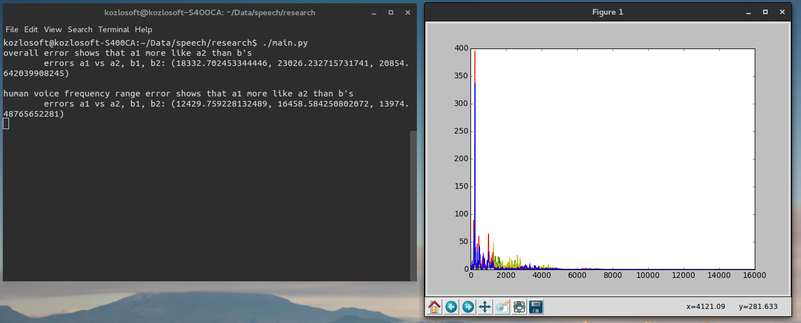
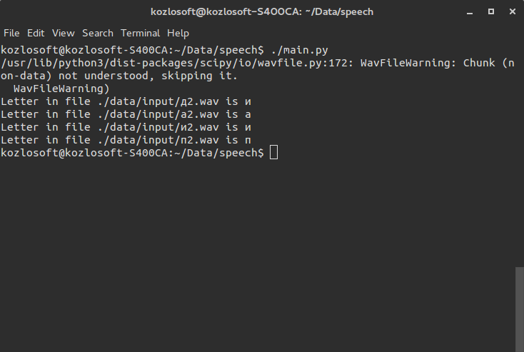

# speech
Распознователь речи, сделанный за несколько вечеров.
Решение использует спектр, полученный быстрым преобразованием Фурье. 

## Постановка задачи
Я на микрофоне ноутбука, в относительно тихой комнате записываю
произношение букв алфавита. Нужно сделать приложение, которое позволит
для еще раз записанных мною букв в тех же условиях определить - что 
за буква алфавита была мною произнесена. 

Входные данные: wav signed 16 PCM mono

## Содержимое проекта
Два исполняемых файла:

* ./research/main.py - описание творческой части решения задачи.
Там масса комментариев на русском языке. 
Там получена экспортируемая функция генерации частотного спектра, и 
выводятся графики спектров рисеч образцов звука:

* main.py - скрипт решающий описанную задачу. 
Сдержанные комментарии на английском языке. 
Производится чтение эталонов, затем входных файлов звука - 
файлы сравниваются по частотным спектрам и выводится решение - 
какая все таки буква произнесена в файле. 
К слову, я честный, поэтому скрывать тот факт что 
вместо "д" распозналась "и" не стал. Тем более что оставшиеся три
буквы распознались правильно =)

